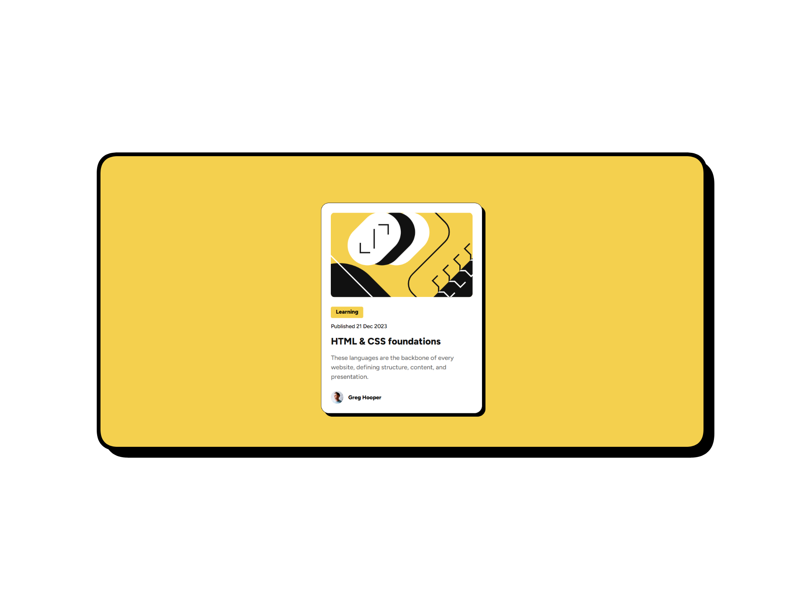

# Frontend Mentor - Blog preview card solution

This is my solution to the [Blog preview card challenge on Frontend Mentor](https://www.frontendmentor.io/challenges/blog-preview-card-ckPaj01IcS).

## 🌐 Language

- [English](./README.md)
- [Português Brasileiro](./README.pt-br.md)

## 📄 Table of contents

- [Frontend Mentor - Blog preview card solution](#frontend-mentor---blog-preview-card-solution)
    - [🌐 Language](#-language)
    - [📄 Table of contents](#-table-of-contents)
    - [🔍 Overview](#-overview)
        - [The challenge](#the-challenge)
        - [📷 Screenshot](#-screenshot)
        - [🔗 Links](#-links)
    - [🛠️ My process](#️-my-process)
        - [💻 Built with](#-built-with)
        - [📚 What I learned](#-what-i-learned)
        - [🚀 Continued development](#-continued-development)
        - [📖 Useful resources](#-useful-resources)
        - [🤖 AI Collaboration](#-ai-collaboration)
    - [👨🏻‍💻 Author](#-author)

## 🔍 Overview

### The challenge

Users should be able to:

- See hover and focus states for all interactive elements on the page

### 📷 Screenshot

### 🔗 Links

- Solution URL: [https://www.frontendmentor.io/solutions/responsive-blog-preview-card-using-flexbox-TjGDw5VspO](https://www.frontendmentor.io/solutions/responsive-blog-preview-card-using-flexbox-TjGDw5VspO)
- Live Site URL: [https://martinsjoaosousa.github.io/blog-preview-card/](https://martinsjoaosousa.github.io/blog-preview-card/)

## 🛠️ My process

### 💻 Built with

- Semantic HTML5
- CSS3
- CSS Flexbox
- CSS custom properties

### 📚 What I learned

During this challenge, I practiced building semantic HTML structures, using the Flexbox layout, and applying CSS alignment and spacing properties to consolidate my understanding of responsive design. I also explored and implemented CSS transitions and custom properties.

### 🚀 Continued development

In addition to practicing responsive design and reinforcing the properties I've learned so far, I plan to deepen my understanding of:

- Relative units (`em` and `rem`)
- CSS functions like `min()`, `max()`, and `clamp()`
- Media queries
- `@font-face` at-rule

### 📖 Useful resources

- [MDN Docs - Using custom properties](https://developer.mozilla.org/pt-BR/docs/Web/CSS/Guides/Cascading_variables/Using_custom_properties) - Helped me understand the syntax and practical application of custom properties.
- [MDN Docs - var() CSS function](https://developer.mozilla.org/pt-BR/docs/Web/CSS/Reference/Values/var) - Showed me how to effectively use custom properties across my style rules.
- [MDN Docs - :root CSS selector](https://developer.mozilla.org/pt-BR/docs/Web/CSS/Reference/Selectors/:root) - Clarified the concept of the `:root` selector, complementing my implementation of CSS variables.
- [MDN Docs - transition CSS property](https://developer.mozilla.org/en-US/docs/Web/CSS/Reference/Properties/transition) - A quick refresher on the syntax of the `transition` property.

### 🤖 AI Collaboration

I used ChatGPT solely for code review and evaluation, using the prompt provided by Frontend Mentor. The feedback helped me identify strengths and weaknesses in my code and catch minor syntax errors caused by simple oversights.

## 👨🏻‍💻 Author

- LinkedIn - [João Martins](https://www.linkedin.com/in/joao-martins-sousa/)
- Frontend Mentor - [@martinsjoaosousa](https://www.frontendmentor.io/profile/martinsjoaosousa)
